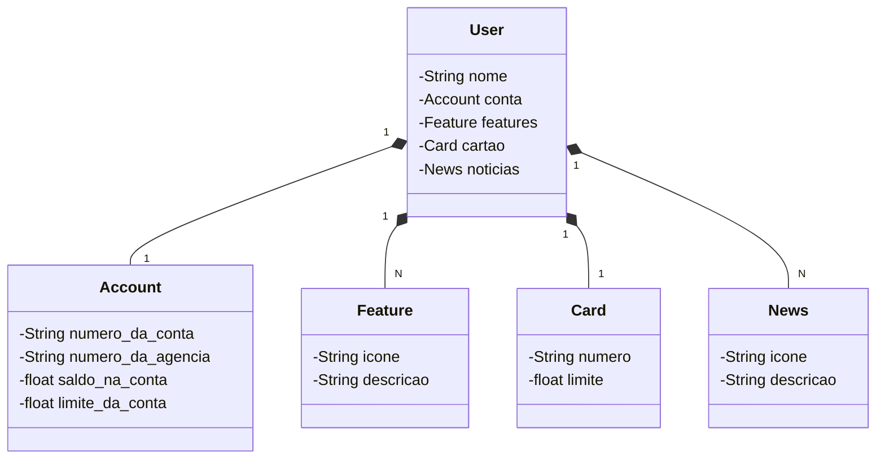

# Projeto Api Rest - Usuário de banco

## Diagrama de classes

```mermaid
classDiagram
    class User {
        -String nome
        -Account conta
        -Feature features
        -Card cartao
        -News noticias
    }

    class Account {
        -String numero_da_conta
        -String numero_da_agencia
        -float saldo_na_conta
        -float limite_da_conta
    }

    class Feature {
        -String icone
        -String descricao
    }

    class Card {
        -String numero
        -float limite
    }

    class News {
        -String icone
        -String descricao
    }

    User "1" *-- "1" Account
    User "1" *-- "N" Feature
    User "1" *-- "1" Card
    User "1" *-- "N" News
```
